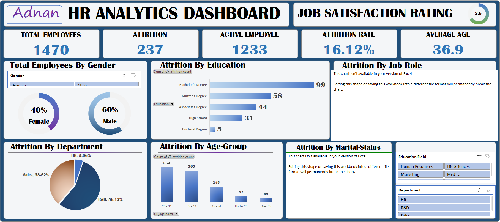

The HR Employee Analysis Dashboard provides a detailed analysis of employee demographics, attrition trends, and workforce stability.
It helps HR teams identify problem areas, improve retention, and foster a more engaged workforce.

This project was developed using Microsoft Excel for:

Data Cleaning

Data Transformation

Interactive Visualizations

📈 Key Insights
1. Total Employees by Gender

40% Female

60% Male
Helps evaluate diversity and representation across the organization.

2. Attrition by Department

Sales: 38.82%

R&D: 56.12%

HR: 5.06%
Identifies high-turnover departments for targeted retention strategies.

3. Attrition by Age Group

Largest attrition in 25-34 and 35-44 age ranges.
Highlights workforce stability challenges among younger and mid-career employees.

4. Attrition by Education

Highest attrition from Bachelor’s degree holders (99 employees).
Can guide training, engagement, and upskilling initiatives.

5. Attrition by Job Role & Marital Status

Reveals turnover patterns linked to specific job roles and personal demographics.

🛠 Tools & Techniques Used

Microsoft Excel

Power Query for data cleaning

Pivot Tables for data transformation

Charts & Slicers for interactive dashboards

Data visualization best practices for clear storytelling.

📂 Project Structure
📁 HR_Employee_Analysis_Dashboard
 ├── 📄 HR_Analytics_Dashboard.xlsx   # Main dashboard file
 ├── 📁 images
 │    └── Dashboard.png               # Dashboard screenshot
 └── 📄 README.md                     # Project documentation

🚀 How to Use

Download the .xlsx file from this repository.

Open in Microsoft Excel (latest version recommended).

Use slicers and filters to explore different HR metrics.

🎯 Impact

This dashboard enables HR teams to:

Detect and address high attrition areas

Monitor diversity metrics

Improve employee satisfaction

Support data-driven HR decisions

Author: Muhammad Adnan